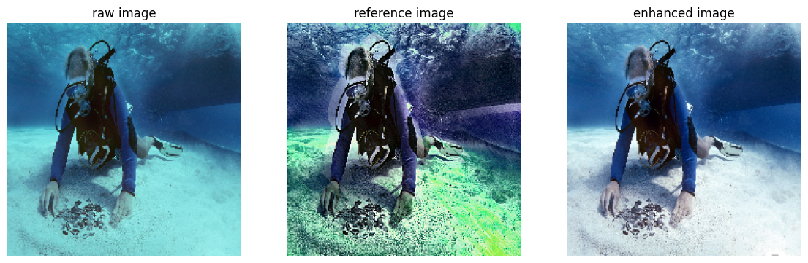

# Optimizing Underwater Image Quality with Deep Reinforcement Learning



This repository contains the implementation and results of a Deep Q-Network (DQN)-based model for enhancing underwater image quality. The project addresses challenges such as poor visibility, color distortion, and low contrast caused by light scattering and absorption in underwater environments.

## Introduction
Underwater imaging is critical for various applications, including marine biology, underwater archaeology, and pipeline inspection. However, challenges such as poor visibility, color distortion, and low contrast significantly degrade image quality. Traditional image enhancement techniques often fall short in addressing these issues comprehensively, while recent convolutional neural network (CNN) approaches have limitations in adaptability to varying underwater conditions.

## Objective
The primary objective of this research is to develop a DQN-based model to enhance underwater image quality by addressing issues related to brightness, contrast, and color saturation.

## Datasets
- **Large-scale Underwater Image (LSUI) Dataset:** This dataset contains 5004 image pairs featuring diverse underwater scenes with various lighting conditions, water types, and target categories, offering high-quality reference images.
- **Underwater Image Enhancement Benchmark (UIEB):** Comprising 890 raw images with corresponding high-quality reference images, this dataset also includes 60 challenge images without reference counterparts.

## General Framework
The model solves a Markov Decision Process (MDP) that consists of the interaction at each step \( t \) between an agent and an environment. The MDP is composed of four components:
- **State $s_t \in S$:** Consists of the set of information that the agent perceives from the environment, represented by features extracted from underwater images.
- **Action $a_t \in A$:** Any behavior the agent can perform in the environment, such as image enhancement operations.
- **Reward $r_t \in R$:** Feedback the agent receives after performing an action, defining how much the action improves the image quality.
- **Policy $\Omega_\theta$:** The strategy the agent uses to decide its next action based on the current state, implemented as an \(\epsilon\)-greedy policy.

## Actions
Image enhancement techniques are categorized into four main types, each with specific actions:
- **Basic Adjustments:** Brightness ±5%, Contrast ±5%, Color Saturation ±5%
- **Color Adjustments:** Red ±5%, Green ±5%, Blue ±5%
- **Corrections:** Gamma Transformation ±, Histogram Equalization (HE), Contrast Limited Adaptive Histogram Equalization (CLAHE), White Balance
- **Deblurring:** Sharpen, Emboss, Dark Channel Prior (DCP)

## Training
The DQN is implemented as an agent composed of four fully connected layers. The input is the current state (image features), and the output is the Q-value for each possible action. The agent is trained using an \(\epsilon\)-greedy policy, and the reward function combines pixelwise and perceptual losses.

## Results
The performance of the model was evaluated on both GPU (NVIDIA RTX A4000) and non-GPU (Intel i7 CPU) systems, demonstrating significant speed improvements with the GPU. Key metrics include:
- **Average MSE:** 1858.02
- **Average PSNR:** 16.99
- **Average SSIM:** 0.742

## Conclusion and Next Steps
The model has demonstrated significant success in enhancing the quality of underwater images. Future work will include:
- Comparing the model's performance with existing solutions.
- Exploring the impact of different hyperparameters.
- Testing the model on diverse image types to evaluate generalization capabilities.

## Citation
If you use this code or dataset, please cite the following:

```
@misc{reyes2024optimizing,
  title={Optimizing Underwater Image Quality with Deep Reinforcement Learning},
  author={Marc Reyes},
  year={2024},
  howpublished={\url{https://github.com/mabreyes/ai322-rl-miniproject}},
}
```

## Acknowledgements
This project was conducted as part of the AI 322 Reinforcement Learning Mini Project. Special thanks to the course instructors and peers for their support and feedback.

For more details, refer to the [presentation slides](./presentation.pdf) and [project notebook](./train.ipynb).

---

Feel free to reach out for any questions or collaborations!